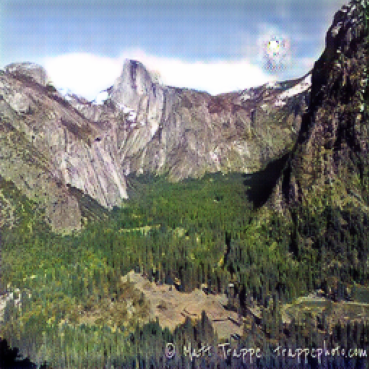

*The project is updating...*
# TorchGAN: Your Ultimate Framework for Building and Customizing GANs
Welcome to TorchGAN, a versatile and user-friendly framework designed to simplify the creation, customization, and deployment of Generative Adversarial Networks (GANs). Whether you're a machine learning researcher, data scientist, or creative coder, TorchGAN empowers you with pre-trained weights, modular tools, and an intuitive API to craft state-of-the-art GAN models tailored to your vision.

## Why TorchGAN?
Generative Adversarial Networks are transforming domains like image synthesis, style transfer, and data augmentation. However, their complexity often poses challenges in training, customization, and deployment. TorchGAN bridges this gap by providing:

- Pre-trained Weights: Kickstart your projects with high-quality weights for popular GAN architectures including `CycleGAN`, `Pix2pix`, `DCGAN`, `cGAN`, `StyleGAN`, ...

- Modular Design: Easily combine datasets, architectures, and training strategies to suit your needs.

- Simplified Workflow: Streamlined APIs for rapid prototyping and deployment.

- Extensibility: Add custom loss functions, datasets, or models with minimal effort.

- Community Focus: Share weights, collaborate on models, and contribute to a growing ecosystem.

## Key Features

- Rich Model Library: Access pre-trained models like DCGAN, CycleGAN, StyleGAN3, and BigGAN.

- Flexible Pipelines: Customize data preprocessing, model architectures, and training loops effortlessly.

- Cross-Platform Compatibility: Run on CPUs, GPUs, or TPUs, locally or in the cloud.

- Visualization Suite: Monitor training with real-time plots and sample generation.

- Dual Interfaces: Use the Python API for advanced control or the CLI for quick experiments.

- Comprehensive Docs: Extensive tutorials and examples to get you up and running.

## Getting Started
### Prerequisites

- Python 3.8+
- PyTorch 1.10+ (with CUDA for GPU support)
- Dependencies: NumPy, Matplotlib, torchvision

### Installation

1. Clone the repository:
    
    ```bash
    git clone https://github.com/yourusername/torchgan.git
    cd torchgan
    ```

2. Install dependencies:

    ```bash
    pip install -r requirements.txt
    ```


3. Quick Example
    
- Train a CycleGAN to convert winter to summer:

    ```python
    from torchgan.models import CycleGAN

    # Initialize model
    # You can set path to your pretrained weigth or use 'default' for our weight
    model = CycleGAN(weight='path/to/your/weights')

    # Inference
    generated_image = model.generate(
        image_path='path/to/your/image',
        save_path='path/to/save'
    )

    # If you want to train on your dataset
    # Load dataset
    dataset = load_dataset(
        dataset_path='path/to/your/dataset'
    )
    # Train
    model.train(
        dataset=dataset,
        epochs=10,
        lr=0.0001,
        step_size=30,
        save_path='path/to/save/weight'
    )


Explore the examples/ folder for more tutorials, including DCGAN, StyleGAN3, and conditional GANs.

## Training Results

### Cycle Gan
- Winter to Summer

<p align="center">
  
  <br>
  
  
</p>

- Summer to Winter

<p align="center">
  
  <br>
  
  
</p>


## Architecture Overview
### Documentation

**CycleGAN: [Project](https://junyanz.github.io/CycleGAN/) |  [Paper](https://arxiv.org/pdf/1703.10593.pdf) |  [Torch](https://github.com/junyanz/CycleGAN) |
[Tensorflow Core Tutorial](https://www.tensorflow.org/tutorials/generative/cyclegan)**

**Pix2pix:  [Project](https://phillipi.github.io/pix2pix/) |  [Paper](https://arxiv.org/pdf/1611.07004.pdf) |  [Torch](https://github.com/phillipi/pix2pix) |
[Tensorflow Core Tutorial](https://www.tensorflow.org/tutorials/generative/pix2pix)**

**Other Model: Updating...**


## License
TorchGAN is licensed under the MIT License. Use, modify, and share it freely!

## Mission

This project aims to make GAN models more accessible to the community, not for commercial purposes, but to foster innovation and collaboration in the field of generative AI. Join us in building a vibrant ecosystem for GAN enthusiasts!

Ready to ignite your GAN projects? Clone TorchGAN, dive into the examples, and start creating with ease! 🔥
